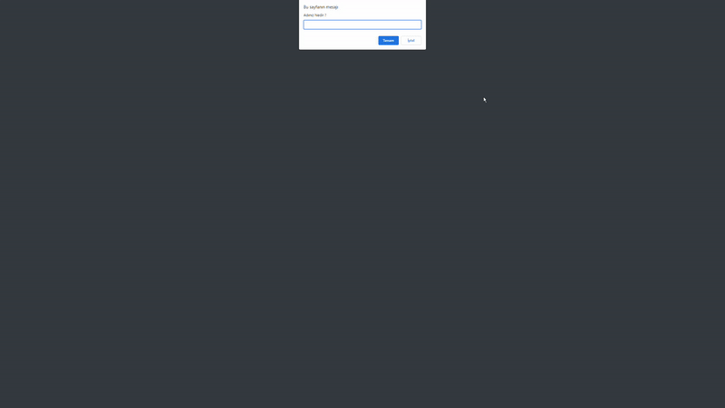

## JavaScript-Clock-Odev-1


 


### Projede; Javascript  ile Saat ve Karşılama çalışması yapılmıştır

---




Bu repo [Kodluyoruz](https://www.kodluyoruz.org/) Front-End Eğitiminde oluşturduğum JavaScript-Clock-Odev-1. İçerisinde bir adet README dosyası, bir adet .html uzantısı, bir adet .css uzantısı ve bir adet js. uzantılı dosya barındırıyor.

## Installation

Öncelikle projeyi clonelayın.

```
https://github.com/Mucahid-Canbey/JavaScript-Clock-Odev-1.git
```

## Usage
Projeyi cloneladıktan sonra Visual Studio Code programında açınız.

Linux için:
```
cd kodluyoruzilkrepo
code .
```
## Contributing
Pull requestler kabul edilir. Büyük değişiklikler için, lütfen önce neyi değiştirmek istediğinizi tartışmak için bir konu açınız.

## License
[MIT](https://choosealicense.com/licenses/mit/)


